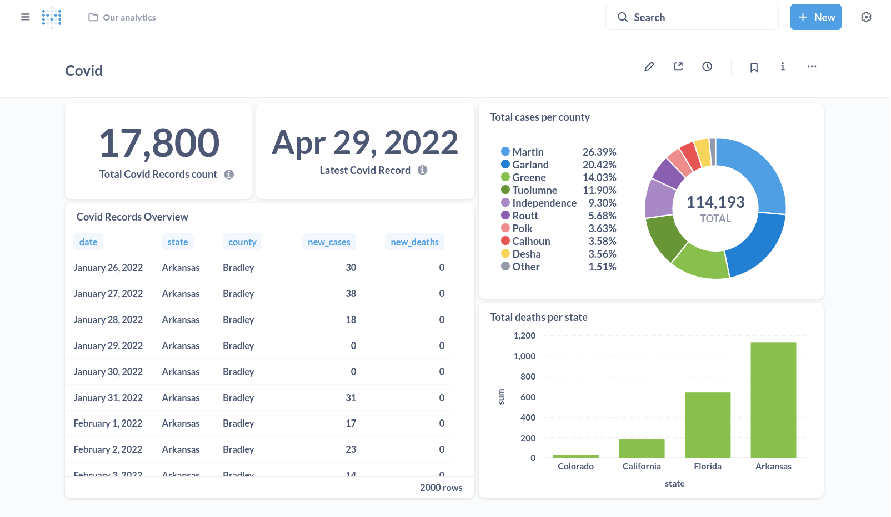
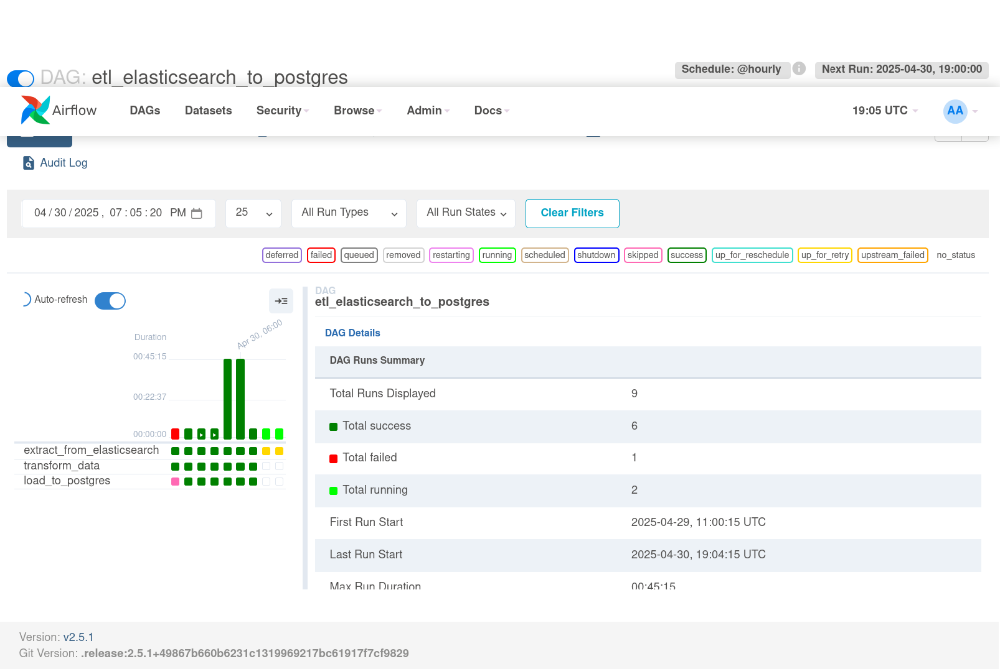

# Overview
This project aimes to design and implement a data pipeline to collect, ingestion, store, process and finally visualize statistics regarding Covid-19 cases in U.S.A. The pipeline is illustrated in the diagram below:


# Entities 

## Elastic ( dockerized ): 
data source

## Apache Airflow ( dockerized ): 
scheduler and orchestrator

## Postgres ( dockerized ):
OLTP Data warehouse 

## metabase ( dockerized ):
Visualization and dashboarding

# steps

1. Capture & Ingest
   
In this section, collected covid-related records of data from hospitals which are gathered in a .csv file are provided and to persist it more seamlessly, I have implemented a python job ( ingest_elastic_to_csv.py ) Which reads data (batchwise) from csv file and inserts to elastic.

To avoid data loss and inconsistency, after each insert, **checkpoints** the offset to a .Jason file and at the beginning of next batch, it reads the checkpoint to read from next offset.

sample content of elastic_checkpoint.json :

{"last_processed_row": 18700}

sample output of ingestion process:

Batch 34 insert status: 200

Inserting Batch 35 (rows 14101 to 14200)...

Batch 35 insert status: 200

Inserting Batch 36 (rows 14201 to 14300)...

Batch 36 insert status: 200

Inserting Batch 37 (rows 14301 to 14400)...

Batch 37 insert status: 200

Inserting Batch 38 (rows 14401 to 14500)...

Batch 38 insert status: 200

Inserting Batch 39 (rows 14501 to 14600)...

Batch 39 insert status: 200

Inserting Batch 40 (rows 14601 to 14700)...

Batch 40 insert status: 200

...

2. ETL
In this section, the raw data in the elastic is needed to be cleaned and processed, and then get inserted to the data warehouse (postgres) to be visualized.
To do so, I implemented a ETL process,  with **checkpoint** to make consistent process without data loss, including below 3 + 1 tasks

### load checkpoint

read last checkpoints before read and insert each batch and also checkpoints after each successful batch insert, to avoid data loss and provide consistency.

### extract

extract data from elastic 

### transform 
process and clean up the data, use only metrics and dimensions valuable to be used for the mission ( visualizing total records and most recent insertion time )

### load

insert the transformed data to DW ( postures)

But since the .csv data might be a fixed data or an stream of data ( never ending ), the first job ( ingestion ) is designed to continously ingest rest of stream. For ETL though, a periodic (hourly) job is needed to do it on new data every hour ( least period interval in airflow )
That's why this job is written as a DAG ( directed acyclic graph ) where there are depencies ( transform task depends on extract, and load depends on transform ). To be failure tolerant, the ETL process also uses checkpointing.

3. USE

The final section is the visualization via metabase. To do so, a distinct database is created in the postgres ( which is also used for metadata of airflow but in different databases ), then an Analytical dashboard is created in which, there are 3 visualizations:

## total counts of covid cases in the csv 

## most recent date of records 

## overview on important columns of the covid records 

The overview of dashboards can be seen in below images. after 30 and 90 batch jobs:

the final output of dashboards:




# How run the project

1. clone the project
   
   ```bash
   git clone git@github.com:PayamZohari/CovidDataPipeline.git
   ```

2. install requirements
   
   pip3 install -r requirements

   then download the .csv data file via https://drive.google.com/file/d/1vL9-7EcFicTR1j4bnWkwt_wf25k0wKnK/view?usp=sharing

   ```bash
   cp /your/path/to/downloads/COVID-19-Activity.csv ./datasource/COVID-19-Activity.csv
   ```

3. look into .env file which contains necessary credentials for the project.

4. set up project pipeline

   ```bash
   docker composed up [-d]
   ```
now elastic is running on port 9200 (without web UI), airflow on port 8080, postgres on port 5432 (without web UI but PGadmin was used for development process), and metabase on port 3000

to enable ariflow log the job runs you need to give permission to the user to make change on ./logs, ./dags, ./plugins and ./checkpoints.

5. Run the ingestion
   
   ```bash
   python3 ingest_csv_to_elastic.py
   ```
   
6. ETL job monitoring

you can monitor ETL process from Airflow web UI. 

you can login by credentials provided in .env ("airflow_ui_user" for username and "airflow_ui_password" for it's password)

Then you should see below overview panel.


now by going through active dags, you should see only one dag named etl_elastic_to_postgres (if not, go to All section to toggle activeness of it). 
by clicking on it you should see a dashboard like below:



here you can see when the previous run was and when will the next run be scheduled (after getting active it would run, and afterwards just one run per hour)


7. Log into visualization

now that you have seen the ETL process is working, it's time to use it's data through metabase. To do so, go on port 3000 to see metabase dashboard.

you can login by credentials provided in .env ("metabase_ui_user" for username and "metabase_ui_password" for it's password)

go through Our Analytic collection, go to Covid dashboard, and there you can see on tab1 there are 5 visualizations as illustrated in the picture. 

